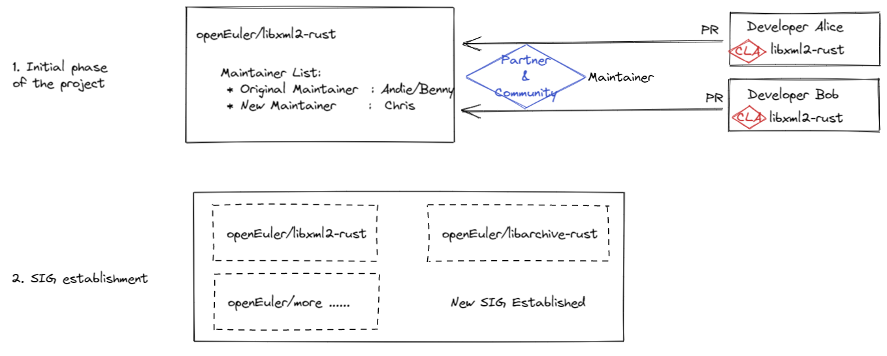

# 开源社区运作流程简介

## 创建repo

### 签署CLA

Gitee账户及最终提交的账户，均要签署CLA，否则无法提交PR

（1）流程参考：[链接](https://www.openeuler.org/zh/community/contribution/)

（2）CLA类型，选“个人CLA”即可

### 订阅SIG

在[这里](https://www.openeuler.org/zh/community/mailing-list/)获取邮件列表，然后就可以订阅对应的SIG邮件

### 创建Repo

创建Repo，可以直接提PR到Community仓
[样例](https://gitee.com/openeuler/community/pulls/3527)

> 参与贡献的整体流程，可参考openEuler官方文档，有兴趣可以阅读下：[链接](https://www.openeuler.org/zh/community/contribution/detail.html#_4-%E8%B4%A1%E7%8C%AE%E5%8E%9F%E5%88%9B%E5%BC%80%E6%BA%90%E9%A1%B9%E7%9B%AE)

### Rust 工具链构筑 - 待补充

> [网址](https://openx.huawei.com/communityHome/postDetail?postId=3177&id=90&sid=722e5e7db9e711eba17afa163efec54d&source=w3)

### 代码合入、PR提交、Committer运作等F&Q

[链接](https://github.com/GeorgeCao-hw/georgedoc/blob/master/openEuler-Infra-FAQ.md)

# 项目运作流程简介
## 组织人员

1. 前期由社区专家担任Maintainer，后期成熟后由合作专家共同担任重构项目Maintainer，负责日常代码提交审核等。
2. 设计/测试方案在社区评审，评审完成后需要在社区发布里程碑；

## 例会形式
1. 项目前期可使用内部交流会形式，成熟后使用SIG组例会形式，扩大社区影响力，吸引更多人参与开源项目。
2. 项目进展通过邮件周度发送一次，会议交流双周一次。

# 团队Repo与社区仓

## 流程介绍

### 项目初始阶段

* 由合作伙伴团队（例如学校的某个项目组）建立一个项目组织，并由组织 Fork openEuler主软件包到组织仓。
* 组织成员，分别Fork组织仓到开发人员个人仓库；
* 组织成员修改代码后，先Push到个人仓库，然后提交PR到组织仓审核；
* 组织审核通过后，合入组织仓；
* 组织仓阶段性（例如周度）向openEuler主仓提交PR，并由主仓Maintainer审核验收

### 原型发布阶段

* 重构软件发布原型软件（例如V1.0）后，项目基本运作成熟；此时可取消原来组织中间仓，直接由个人开发者向openEuler主仓提交PR
* 同时，由组织推举代表，竞选openEuler软件包主仓Maintainer，便于后期代码提交审核

### 生态SIG建立

* 多款Rust重构类软件包发布后，可考虑成立单独SIG组进行统一运作管理。

## 流程图示

